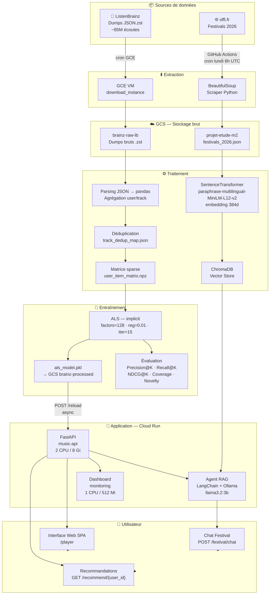

# Recommandation Musicale & Agent IA Festival 2026
**Projet d'étude M2 — Systèmes de recommandation, RAG et déploiement Cloud**
Tags : Musique · IA / RAG · Cloud GCP — Juin 2026

---

## Plan (Sommaire)
01. Contexte & Objectifs
02. Architecture Globale
03. Recommandation Musicale (ALS)
04. Agent Festival RAG
05. Pipeline de données
06. Déploiement Cloud (GCP)
07. Dashboard de monitoring
08. API & Interface utilisateur
09. Résultats & Métriques
10. Conclusion & Perspectives

---

## 01 — Contexte : Pourquoi ce projet ?

- **Besoin 1** : Recommander de la musique personnalisée → Filtrage collaboratif ALS
- **Besoin 2** : Répondre aux questions sur les festivals 2026 → Agent RAG conversationnel

Chiffres clés :
- ~85 M d'écoutes (ListenBrainz)
- 30 dumps incrémantaux
- Festivals indexés en France (FR 2026)

---

## 02 — Architecture Globale : Vue d'ensemble du système

- **Utilisateur** : Interface Web · API REST
- **Recommandation ALS** : Filtrage collaboratif (collaborative filtering) sur les écoutes implicites
  - modèle `.pkl` + matrice `.npz`
- **Agent Festival RAG** : LangChain + ChromaDB + Ollama (LLM local)
  - embeddings multilingues
- **Cover Service** : Deezer API (primaire) + iTunes (fallback) — cache mémoire, rate limiting 10 req/s
- **Bibliothèque utilisateur** : Likes & Playlists persistés sur disque (JSON)
- Stack globale : Python · FastAPI · GCP · Docker · Terraform

### Démarrage de l'API
- **Au démarrage** : chargement du catalogue (`track_dedup_map.json`) et de la bibliothèque utilisateur
- **Modèle ALS** : chargement **lazy** via `POST /reload` (async, en arrière-plan) — l'API répond immédiatement
- Chargement GCS et calculs ALS exécutés dans des threads via `asyncio.to_thread()` pour ne pas bloquer la boucle événements

---

## 02 — Schéma global : Extraction → Traitement → Entraînement → Application



---

## 03 — Données : Sources & volume (ListenBrainz & Festivals)

### Recommandation — ListenBrainz
- Dumps incrémantaux publics (JSON `.zst`)
- ~85 millions d'écoutes
- Champs : `user_id`, `track_name`, `artist_name`, `timestamp`, `recording_mbid`
- Période : Décembre 2025 — Janvier 2026

### Agent RAG — Festivals 2026
- Scraping de offi.fr
- Données : nom, dates, lieu, artistes, billetterie
- Export JSON → GCS → Embeddings → ChromaDB
- Festivals musicaux français

### Pipelines de données
- **offi.fr** → JSON → GCS → Embeddings → ChromaDB
- **ListenBrainz** → GCS (raw) → Parsing → Matrice sparse → ALS

---

## 03 — Recommandation : Filtrage collaboratif ALS (Alternating Least Squares)

- Matrice User × Track (sparse), exemple :

| | t1 | t2 | t3 |
|---|---|---|---|
| u1 | 3 | 0 | 7 |
| u2 | 0 | 1 | 0 |
| u3 | 5 | 0 | 2 |

- ALS → Vecteurs users (128d) × Vecteurs tracks (128d) → Score = produit scalaire → Top-N recommandations

### Hyperparamètres retenus
- Facteurs latents : 128
- Régularisation L2 : 0.01
- Itérations : 15
- GPU : Non (CPU)

> Algorithme utilisé par Spotify & Netflix, adapté aux données implicites (nombre d'écoutes).

---

## 03 — Recommandation : Pipeline ML, de la donnée brute au modèle

1. **Téléchargement** : Dumps via GCE → GCS raw
2. **Parsing** : JSON → pandas, agrégation
3. **Construction** : Matrice sparse (`.npz`)
4. **Déduplication** : `track_dedup_map.json`
5. **Entraînement** : ALS implicit → `.pkl`
6. **Évaluation** : Precision@K · Recall@K · NDCG@K · Novelty · Coverage
7. **API Cloud Run**

Code exemple :
```python
model = AlternatingLeastSquares(factors=128, regularization=0.01, iterations=15)
model.fit(item_user_matrix)   # matrice transposée pour implicit
item_ids, scores = model.recommend(user_id, user_items, N=10)
```

---

## 04 — Agent RAG : Agent conversationnel Festivals 2026

**Qu'est-ce que le RAG ?** Retrieval-Augmented Generation

Étapes :
1. Encoder la query : SentenceTransformer · `paraphrase-multilingual-MiniLM-L12-v2` · embedding 384d
2. ChromaDB Vector Store : recherche vectorielle · cosine similarity · top-5
3. Contexte injecté : festival (nom, dates, lieu, artistes, billetterie)
4. LLM (Ollama · llama3.2:3b) : génération avec historique de session
5. → Réponse en langage naturel

**Exemple de question** : « Quels festivals en juillet accueillent GIMS ? »

> La query est vectorisée, les festivals pertinents sont récupérés, puis le LLM rédige la réponse à partir du contexte.

---

## 04 — Agent RAG : Stack technique (LangChain + ChromaDB + Ollama)

| Composant | Technologie | Rôle |
|---|---|---|
| Orchestration | LangChain AgentExecutor | Coordination LLM + outils |
| LLM | Ollama llama3.2:3b | Génération de réponses |
| Embeddings | SentenceTransformer `paraphrase-multilingual-MiniLM-L12-v2` | Encodage requêtes & docs |
| Vector store | ChromaDB (local ou HTTP) | Stockage & recherche vectorielle |
| Scraping | BeautifulSoup + requests | Collecte données festivals |
| API | FastAPI · POST /festival/chat | Exposition de l'agent |

### Gestion des sessions
- Historique en mémoire (dict Python par `session_id`)
- UUID généré automatiquement si absent
- Réinitialisation via `DELETE /festival/sessions/{id}`
- Max 3 itérations de raisonnement (boucle ReAct)

### Mise à jour automatique des données festivals
- GitHub Actions `festival-update.yml` : cron **tous les lundis à 6h UTC**
- Scraping → validation JSON → commit automatique si changements
- Job optionnel de ré-indexation ChromaDB sur runner self-hosted

---

## 05 — Cloud : Déploiement sur Google Cloud Platform

### Google Cloud Platform
- Cloud Run · `music-api` : 2 CPU / 8 Gi · Port 8000
- Cloud Run · `music-dashboard` : 1 CPU / 512 Mi · Port 8080

### GCS Buckets
- `brainz-raw-lb` : Dumps bruts
- `brainz-raw-mb` : MusicBrainz
- `brainz-processed` : Modèle `.pkl`
- `projet-etude-m2` : Festivals

### Autres
- Région : europe-north1-a · download data + training
- Services tiers : Pinecone · OpenAI · Google API Key

---

## 05 — Cloud : Infrastructure as Code avec Terraform

### Ressources gérées
- `google_cloud_run_v2_service` : API + Dashboard
- `google_artifact_registry_repository` : Images Docker
- `google_storage_bucket` : Buckets GCS
- `google_compute_instance` : VM de traitement
- `google_secret_manager_secret` : Secrets API keys
- `google_service_account` + IAM : Sécurité

### Avantages
- Infrastructure versionnée (Git)
- Reproductible en un `terraform apply`
- Séparation secrets / configuration

### CI/CD — GitHub Actions (4 workflows)

| Workflow | Déclencheur | Rôle |
|---|---|---|
| `ci.yml` | push / PR sur main | Lint Ruff · type check Pyright · import checks |
| `deploy.yml` | push main sur `src/**` | Build Docker → Artifact Registry → deploy Cloud Run |
| `festival-update.yml` | cron lundi 6h UTC + manuel | Scraping festivals → commit JSON → re-indexation ChromaDB |
| `terraform.yml` | push sur `infra/**` | `terraform plan` / `apply` |

- **Auth GCP** : Workload Identity Federation (pas de clé service account stockée)

---

## 06 — API & Interface : Points d'entrée FastAPI

### Système
- `GET /health`
- `GET /stats`
- `POST /reload` · `GET /reload/status` ← chargement async du modèle ALS

### Recommandation
- `GET /recommend/{user_id}`
- `GET /similar/{track_id}`
- `GET /history/{user_id}`

### Catalogue
- `GET /catalog/tracks` ← pagination
- `GET /catalog/search?q=` ← tri par relevance ou popularité
- `GET /catalog/artist?artist=` ← tous les titres d'un artiste
- `GET /catalog/artists?q=` ← recherche d'artistes avec comptage
- `GET /catalog/cover` ← Deezer (primaire) + iTunes (fallback), cache mémoire

### Bibliothèque
- `POST /library/{id}/likes` · `DELETE /library/{id}/likes/{item_id}`
- `GET /library/{id}/likes` · `GET /library/{id}/likes/{item_id}`
- `POST /library/{id}/playlists` · `GET /library/{id}/playlists`
- `GET /library/{id}/playlists/{pid}` · `PATCH` (renommer) · `DELETE`
- `POST /library/{id}/playlists/{pid}/tracks` · `DELETE .../tracks/{item_id}`

### Festival RAG
- `POST /festival/chat`
- `DELETE /festival/sessions/{id}`

### Interface web
- `GET /player` (SPA)
- `GET /docs` (Swagger)

---

## 07 — Monitoring : Dashboard de suivi du pipeline en temps réel

- **Statut GCS** : volume des buckets (GB, fichiers), présence de `als_model.pkl`, métriques `evaluation_results.json`
- **Statut GCE** : instances actives (labels projet), logs VM (port série), terminaison d'instance
- **Logs temps réel** : WebSocket `/ws/logs`, streaming subprocess Python, terminal intégré (web)

### Progression du pipeline
Données brutes → Déduplication → Agrégation → ⏳ Entraînement ALS → Pipeline terminé

---

## 08 — Résultats : Performances du système

### Métriques de recommandation
| Métrique | Description | Seuil |
|---|---|---|
| Precision@10 | % recs pertinentes / 10 | > 0.05 |
| Recall@10 | % items pertinents retrouvés | > 0.02 |
| MAP@10 | Précision moyenne pondérée | > 0.04 |
| NDCG@10 | Qualité du ranking (Discounted Cumulative Gain normalisé) | > 0.05 |
| Novelty | Capacité à recommander des items non populaires | — |
| Couverture | % du catalogue recommandé | > 30% |

### Algorithmes comparés
- **ALS (retenu)** → Cold start, biais populaire
- **Content-Based** → Requiert métadonnées riches
- **Hybride (LightFM)** → Plus complexe à tuner
- **Séquentiel (SASRec)** → GPU requis

> ALS retenu comme MVP optimal pour notre volume de données et nos contraintes de ressources.

---

## DevOps : Qualité du code & bonnes pratiques

- **Dépendances** : `uv` + `pyproject.toml` (pas de `requirements.txt`), groupes : airflow, spark
- **Qualité du code** : Ruff (linter), Pyright (type checking), Pydantic v2 (validation API), architecture en couches
- **Containerisation** : `Dockerfile` (API), `Dockerfile.dashboard`, `docker-compose.yml`
- **Orchestration (optionnel)** : Airflow DAG `listenbrainz_pipeline.py` (download → train → eval)

---

## 09 — Conclusion : Bilan & améliorations futures

### Ce qui a été réalisé
- Recommandation ALS entraînée sur 85M écoutes
- Agent RAG conversationnel festivals 2026 avec mise à jour hebdomadaire automatisée
- API REST complète : catalogue, likes, playlists, covers (Deezer/iTunes)
- Interface web (SPA) intégrée
- Dashboard monitoring temps réel
- Cloud Run + Terraform + CI/CD GitHub Actions (4 workflows)
- Architecture entièrement async (chargement GCS + inférence ALS non-bloquants)

### Améliorations envisagées

**Court terme**
- Modèle hybride LightFM
- Cache Redis (API)
- Authentification users

**Long terme**
- SASRec (séquentiel) / Meilleur cold start
- Graph NN (LightGCN)
- Streaming réel (Kafka)
- Fine-tuning LLM festival
- A/B testing modèles
- Enrichissement Spotify API

---

## Questions

Merci pour votre attention

- GitHub (repo privé)
- [URL Cloud Run]/docs
- [URL Cloud Run Dashboard]

**Stack en une ligne** :
Python · FastAPI · ALS (implicit) · LangChain · ChromaDB · Ollama · GCP (Cloud Run + GCS + GCE) · Terraform · Docker · GitHub Actions
